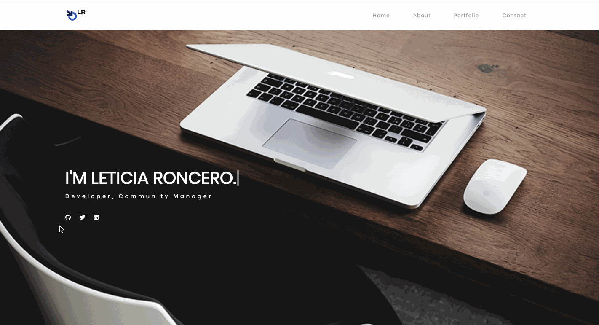

# Portfolio Website
New portfolio website with an updated design, and most recent projects additions. This updated version has a functional contact form and a database that stores all information from visitors who reach out via said contact form.

## Demo




## Built With

***Frontend***
* HTML
* CSS
* Bootstrap Grid Layout
* JavaScript
* Jquery

***Backend***
* Node.js
* npm packages:
    * express
    * mysql2
    * sequalize 
- Heroku for deployment

## Code Highlights

API route to create a new entry in the Contacts table in our database when visitors fill out the Contact Form.

```router.post("/", function (req, res) {
    db.Contact.create({
        name: req.body.name,
        email: req.body.email,
        subject: req.body.subject,
        message: req.body.message
    })
        .then(function () {
            res.redirect("/");
        })
        .catch(function (err) {
            res.status(400).json(err);
        }); 
```

## Links
[Deployed Portfolio Site - Heroku](https://obscure-journey-83186.herokuapp.com/)

[LinkedIn](https://www.linkedin.com/in/leticiaroncero/)